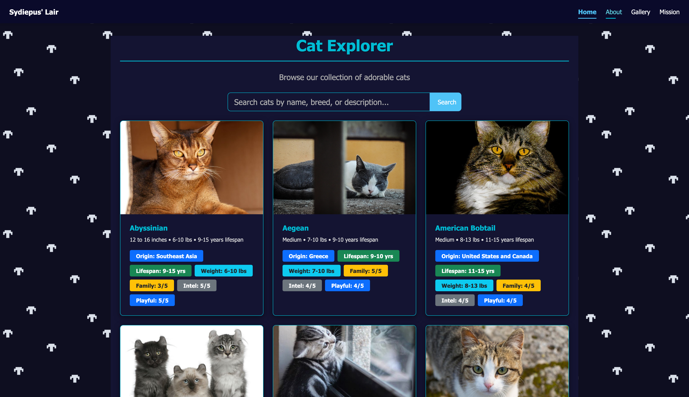
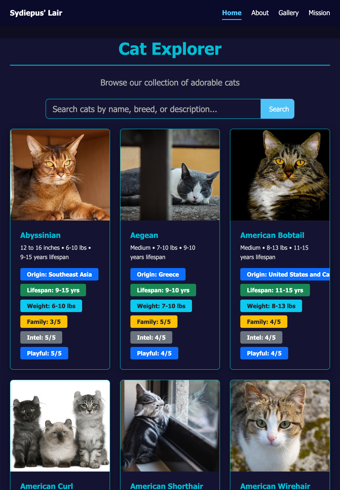

# Me

I am Charbel Assaaad.

# CatInfo - Responsive Cat Information Website

A responsive website displaying cat information fetched from the API-Ninjas Cat API, with personal content about why cats make great pets.

## Responsive Card Grid with Hover Effects

I designed a responsive card grid to display the cat data returned from the API. The grid uses CSS Grid with `repeat(auto-fill, minmax(300px, 1fr))`, so cards automatically reflow into as many columns as fit the screen width, with each card never shrinking below 300px. 
Breakpoints at 768px and 576px adjust image heights, spacing, and navbar layout for tablet and mobile, while a breakpoint at 1200px increases image height on larger screens.

Each card has a hover effect: it lifts up with a shadow (`translateY(-8px)`), the image inside zooms slightly (`scale(1.05)`), and a dark gradient overlay fades in over the image revealing the cat's name and a short description.

## Features

- Responsive card grid layout with hover effects
- Search and filter functionality
- Pagination for browsing cats
- Personal about page with cat content
- Gallery page
- Secure API integration via serverless functions

## Setup & Installation

### Prerequisites
- Node.js (for local development with Vercel CLI)
- Vercel account (for deployment)
- API key from [API-Ninjas](https://api-ninjas.com/)

### Local Development

1. **Clone the repository:**
   ```bash
   git clone <your-repo-url>
   cd <your-project-folder>
   ```

2. **Set up environment variables:**
   ```bash
   # Copy the example file
   cp .env.example .env.local
   
   # Edit .env.local with your API key
   # Use NINJA_KEY
   ```

3. **Install Vercel CLI:**
   ```bash
   npm install -g vercel
   ```

4. **Run the development server:**
   ```bash
   vercel dev
   ```
   - Your site will be available at `http://localhost:3000`
   - The serverless function will be available at `http://localhost:3000/api/cats`
   - The API key from `.env.local` will be automatically loaded

### Note on Environment Variables
> Use variables from `.env.example` as your template. Copy it to `.env.local` for local development (this file is automatically gitignored). For deployment to Vercel, add the same variables in your project's Environment Variables settings.

## Deployment

### Vercel (Recommended)

1. **Push your code to GitHub**

2. **Import the project in Vercel:**
   - Go to [https://vercel.com](https://vercel.com)
   - Click "Add New" → "Project"
   - Import your GitHub repository

3. **Add Environment Variable:**
   - Go to your project → Settings → Environment Variables
   - Add `NINJA_KEY` with your API-Ninjas API key

4. **Deploy:**
   - Click "Deploy"
   - Vercel will automatically detect the `api/cats.js` serverless function
   - Your site will be live with secure API access

### Important Security Note
- **Never commit your API key** - It's in `.gitignore` for a reason
- The serverless function (`api/cats.js`) keeps your key safe by proxying requests
- Environment variables in `.env.local` are automatically excluded from git

## API Used
- [API-Ninjas Cat API](https://api-ninjas.com/api/cats) - Free tier available

## Browser Support
- Firefox
- Chrome
- Safari
- Edge

## AI-Use Appendix

### Tools Used
- Mistral AI

### Prompts Used
- The first prompt was to create the plan of the project.
```
Given this requirement file create the readme for the project and create a PLAN.md file.

I want my website to display information about cats I want to pull cat information from from API ninjas.
for my own content I will add explanation about why cats are cool and my experience with them.

My project is to Design a responsive card grid layout with hover effects
```
- Subsequent prompts where to implement the phase like:
```
Let's Implement Phase x
```
- Implementing the mission.html, I already had the html for the main page ready so that AI only had to update the background and integrate navbar:
```
Given this html add this as a mission section on this site use images/web-back-cat-nose-flat.gif as a background on all the site.
```

### What AI Got Wrong & How I Fixed It
- After adding Bootstrap 5 CSS, the navbar was displaying the different pages vertically, after debugging the CSS I found that bootstrap applies `flex-direction: column;` to the navbar which I was able to override with `flex-direction: row;` in my `navbar-nav` class.
- Navbar disappearing on mobile devices, remove `display: none;` from `@media (max-width: 768px)`
- API call was using params that are available, I provided the model with the documentation and did some manual fixes to make it work.

## Screenshots

### Desktop View (1920x1080)

### Tablet View (iPad - 768px)

### Mobile View (iPhone SE - 375px)

